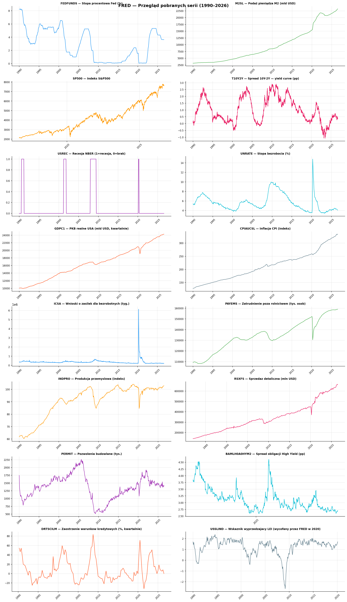

# Fed, pieniądz i rynki - analiza cykli monetarnych 1990-2026

Jak polityka Rezerwy Federalnej przekłada się na rynki i gospodarkę realną. 17 serii
makroekonomicznych, 441 obserwacji miesięcznych, styczeń 1990 - wrzesień 2026.
Python + SQLite + Excel + Power BI.

**Autor:** Wojciech Pakulski

### 📊 [Interaktywny dashboard →](https://wp-pakulski.github.io/fed-recession-signals/reports/dashboard.html)

Siedem paneli: S&P 500, krzywa dochodowości ze stopą Fed, podaż pieniądza M2, inflacja CPI
wobec realnej stopy, bezrobocie z Sahm Rule, VIX oraz Recession Scorecard. Wykresy można
przybliżać i odczytywać wartości punkt po punkcie.

---

## Co z tego wyszło

**1. Ujemna realna stopa Fed nie daje wyższych zwrotów z giełdy.** Popularna teza mówi,
że tani pieniądz napędza S&P500. Test t-Welcha na 417 miesiącach: średni zwrot 12-miesięczny
wynosi **10,1% w obu reżimach**, `t = -0,008`, **`p = 0,993`**. Różnica jest nie do odróżnienia
od zera, a mediana jest nawet nieco wyższa przy dodatniej realnej stopie.
Hipoteza, poziom istotności i naruszone założenie testu: [Metoda i walidacja](#metoda-i-walidacja).

**2. Obniżki stóp Fed nie napędzają giełdy - wypadają najgorzej z trzech reżimów.**
W 12 miesięcy po obniżce S&P500 rośnie średnio o **7,7%**, po podwyżce o **11,7%**,
przy braku zmian o 11,2% (427 miesięcy, 1990-2026). Mechanizm jest odwrotny do intuicji:
Fed obniża, gdy gospodarka słabnie, więc obniżka jest objawem problemu, a nie prezentem
dla rynku. To zapytanie dawało wcześniej przeciwną kolejność reżimów, bo w bazie siedziała
10-letnia seria S&P500 zamiast pełnej - policzone na 112 miesiącach zamiast 427.
Zapytanie: [`sql/03_fed_a_rynki.sql`](sql/03_fed_a_rynki.sql).

**3. Rekordowa inwersja krzywej nie zapowiedziała recesji.** Spread 10Y-2Y był ujemny przez
**26 kolejnych miesięcy** (lipiec 2022 - sierpień 2024) - najdłużej w całej analizowanej
historii. Recesja nie nastąpiła. Trzy wcześniejsze inwersje poprzedzały recesję średnio
o 14 miesięcy.

**4. Połowa popularnych wskaźników recesji nie wyprzedza recesji.** Przy kalibracji progów
na rozkładzie historycznym okazało się, że **Sahm Rule, spread HY i wnioski o zasiłek**
mają w oknie 12 miesięcy przed recesją niemal identyczny rozkład co w spokojnych czasach -
rosną dopiero w jej trakcie. Realnie wyprzedzają tylko krzywa dochodowości (mediana 0,12
wobec 1,05) i pozwolenia budowlane (-5,1% wobec +4,5%).

**5. Model uczony in-sample potrafi mylić fazę cyklu z przyczyną.** Regresja logistyczna
osiąga ROC AUC **0,819**, ale współczynnik przy bezrobociu jest **ujemny**: model odczytuje
wysokie bezrobocie jako „dołek już za nami", bo rośnie ono najmocniej *w trakcie* recesji,
a zmienna objaśniana pyta o *następne* 12 miesięcy. Przy czterech recesjach w próbie nie ma
materiału, by to rozróżnić - i dlatego model jest w projekcie opisany jako ilustracja,
nie prognoza.



---

## Wskaźnik do bieżącego użytku

`scripts/sygnaly_recesyjne.py` generuje [przegląd ośmiu sygnałów recesyjnych](reports/sygnaly_recesyjne.md)
jednym poleceniem:

```bash
python scripts/sygnaly_recesyjne.py
```

Progi nie są dobrane na wyczucie, tylko na rozkładzie historycznym 1990-2026: **UWAGA** gdy
wskaźnik trafia w najgorsze 25% obserwacji, **ALARM** w najgorsze 10%.

Backtest liczony przez `backtest()` w tym samym skrypcie, na trzech recesjach:

| Okres | Średnio flag | Maksimum | Miesięcy |
|---|---|---|---|
| 12 miesięcy przed recesją | **2,56** | 4 | 36 |
| w trakcie recesji | **5,46** | 7 | 28 |
| pozostałe miesiące | **1,51** | 7 | 291 |

Liczone wyłącznie na miesiącach z kompletem ośmiu wskaźników. To ogranicza próbę
do okresu od grudnia 1996, bo wtedy zaczyna się seria spreadu HY - a tym samym
do trzech recesji, nie czterech. Okno przed recesją 1990-1991 nie ma ani jednego
miesiąca z pełnymi danymi.

**Średnia separuje reżimy, maksimum już nie.** Spokojne miesiące też dochodzą do 7 flag,
a te najwyższe odczyty wypadają **po** recesjach, nie przed nimi: pięć miesięcy tuż po
GFC (2009), trzy po dot-comie, plus skupisko w 2024 przy inwersji, która nie skończyła
się recesją. Ten zestaw wskaźników jest bardziej opóźniony niż wyprzedzający i tak
trzeba go czytać.

Ostatni wyraźny sygnał to listopad 2025 (4 flagi). Od stycznia 2026 odczyty mieszczą się
między 0 a 2; ostatni miesiąc z kompletem danych to lipiec 2026 z jedną flagą.

---

## Jak to uruchomić

```bash
pip install -r requirements.txt
```

Notebooki uruchamia się **w kolejności numerycznej 01 → 02 → 03 → 04 → 05**.
Do bazy zapisują wyłącznie 01 i 02, pozostałe trzy tylko z niej czytają - dzięki temu
wynik nie zależy od tego, w jakiej kolejności je odpalisz.

| Notebook | Co robi |
|---|---|
| `01_data_collection` | pobiera 15 serii z FRED oraz S&P500 i VIX z Yahoo Finance |
| `02_sqlite_queries` | buduje bazę SQLite i widok `v_master`, 10 zapytań analitycznych |
| `03_dashboard` | interaktywny dashboard Plotly, Recession Scorecard |
| `04_analysis` | percentyle, momentum M2, test hipotezy |
| `05_rozszerzenia` | VIX, korelacje, timeline inwersji, regresja logistyczna |

Baza `data/fed_cycles.db` nie jest wersjonowana - powstaje z plików w `data/raw/`.

Zapytania analityczne da się odpalić bez Pythona, wprost na gotowej bazie:

```bash
sqlite3 -header -column data/fed_cycles.db < sql/02_sygnaly_recesyjne.sql
```

| Plik | Zawartość |
|---|---|
| `sql/01_baza_i_widoki.sql` | schemat `raw_series`, `dim_recession`, widok `v_master` (format długi na szeroki przez `MAX(CASE WHEN ...)`) plus trzy zapytania kontrolne |
| `sql/02_sygnaly_recesyjne.sql` | krzywa dochodowości, epizody inwersji techniką gaps and islands, Sahm Rule na oknie kroczącym, czas trwania recesji, warunki makro rok przed nią |
| `sql/03_fed_a_rynki.sql` | M2 przed recesją, realna stopa per dekada, zwroty S&P500 po decyzjach Fed, spadek indeksu w recesji, stan bieżący |

Każde zapytanie ma nad sobą pytanie, na które odpowiada, i wniosek z liczbami z jego
własnego wyniku. Liczby w komentarzach sprawdzone przez uruchomienie plików na bazie.

---

## Struktura

```
notebooks/    pięć notebooków, pełny łańcuch od pobrania danych do analizy
sql/          model danych i 10 zapytań analitycznych, każde z komentarzem PYTANIE/WNIOSEK
scripts/      sygnaly_recesyjne.py - generator raportu
data/raw/     17 plików CSV: dane źródłowe z FRED i Yahoo Finance
reports/      writeup, raport sygnałów, słownik wskaźników, 9 wykresów, dashboard HTML
excel/        skonsolidowany arkusz zbudowany w Power Query
powerbi/      model danych i raport .pbix
```

Arkusz Excel i model Power BI zbudowano na danych z kwietnia 2026 i nie były od tego
czasu odświeżane - liczby w nich pochodzą z tamtego pobrania. Część analityczna
(notebooki, raporty, wykresy) korzysta z danych aktualnych.

Pełne omówienie metody i wyników: **[reports/writeup.md](reports/writeup.md)**
Wyjaśnienie każdego wskaźnika: [reports/slownik_wskaznikow.md](reports/slownik_wskaznikow.md)

---

## Dane

FRED (Federal Reserve Bank of St. Louis), publiczny endpoint CSV bez klucza API, oraz Yahoo
Finance przez `yfinance` dla S&P500 i VIX.

Dwa ograniczenia warte odnotowania:

- FRED skraca historię serii licencjonowanych przy pobraniu - indeks ICE BofA oddaje
  tylko 3 ostatnie lata. Notebook 01 dopisuje nowe dane do istniejących plików
  w `data/raw/`, zamiast je nadpisywać - dlatego CSV są częścią repozytorium.
- S&P500 z FRED miał ten sam problem (10 lat zamiast 36), dlatego indeks i VIX pobierane
  są z Yahoo Finance, gdzie pełna historia przychodzi przy każdym odświeżeniu. Razem:
  15 serii z FRED, 2 z Yahoo, 17 serii w bazie.
- Seria `USSLIND` (wskaźnik wyprzedzający) kończy się w lutym 2020 - została wycofana
  przez FRED i nie da się jej odświeżyć.

---

## Metoda i walidacja

Wnioski powyżej opierają się na różnych narzędziach i mają różną siłę dowodową.
Poniżej wprost, które jest które.

**Test hipotezy (wniosek 1).** Test t Welcha dla dwóch prób o nierównych wariancjach,
`scipy.stats.ttest_ind(equal_var=False)`, poziom istotności α = 0,05.

- H₀: średni 12-miesięczny zwrot S&P500 jest taki sam w miesiącach z ujemną
  i dodatnią realną stopą Fed
- H₁: przy ujemnej realnej stopie zwrot jest wyższy
- Próby: n = 197 (realna stopa < 0) wobec n = 220 (>= 0), okres 1990-2026
- Wynik: średnia 10,1% wobec 10,1%; mediana 11,8% wobec 12,2%;
  odchylenie 14,2 wobec 17,0; `t = -0,008`, `p = 0,9934`
- Decyzja: brak podstaw do odrzucenia H₀

Wariant Welcha, nie Studenta, bo odchylenia w grupach różnią się o blisko 3 pp -
zakładanie równych wariancji byłoby tu nieuprawnione.

**Założenie, które ten test narusza.** Zwroty forward 12M na danych miesięcznych
nakładają się na siebie w 11 z 12 miesięcy, więc 417 obserwacji nie jest niezależnych -
efektywnie jest ich około 35. Nakładanie zaniża wariancję, a więc zawyża istotność.
Obciążenie działa zatem przeciw wykryciu efektu jako istotnego, a nie na jego rzecz:
gdyby test pokazał różnicę, byłaby podejrzana. Pokazał `p = 0,993`, więc wniosek
„różnicy nie widać" jest wobec tego problemu odporny. Test na nienakładających się
okresach rocznych zostawiłby 35 obserwacji - za mało, by cokolwiek wykryć, i to jest
druga strona tego samego ograniczenia.

**Korelacja (heatmapa, 11 wskaźników).** Pearson na oknie 1990-2026, mieszanka
poziomów i dynamik rocznych. Najsilniejsze pary: stopa Fed x realna stopa r = +0,77,
spread HY x VIX r = +0,73, krzywa dochodowości x bezrobocie r = +0,71.
Żaden z 11 wskaźników nie ma wszystkich |r| < 0,3, czyli nie ma tu sygnału niezależnego
od pozostałych. To wynik opisowy, nie test: część korelacji na poziomach jest zawyżona
wspólnym trendem, a stacjonarności serii nie badałem (brak testu ADF).

**Model klasyfikacyjny (wniosek 5).** Regresja logistyczna, `StandardScaler`,
`class_weight='balanced'`, 416 miesięcy, zmienna objaśniana = recesja w ciągu
następnych 12 miesięcy (63 przypadki, 15,1% próby).

- ROC AUC 0,819, **liczone in-sample** - bez podziału na zbiór uczący i testowy
  i bez walidacji krzyżowej szeregów czasowych
- dla klasy „recesja": czułość 0,73, precyzja 0,33 - wyrównanie wag klas kupuje
  wykrywalność kosztem fałszywych alarmów
- współczynniki standaryzowane nie są interpretowalne przyczynowo: przy korelacjach
  rzędu 0,7 między zmiennymi objaśniającymi znaki rozkładają się arbitralnie,
  co widać na ujemnym współczynniku przy bezrobociu (wniosek 5)

AUC 0,819 in-sample nie jest miarą zdolności prognostycznej. Uczciwa ocena wymaga
podziału po czasie, a przy czterech recesjach w próbie każdy podział zostawia
w zbiorze testowym najwyżej jedną - dlatego model jest w projekcie ilustracją metody,
nie prognozą.

**Progi wskaźników (wniosek 4).** Kalibracja na rozkładzie historycznym: porównanie
median w oknie 12 miesięcy przed recesją z pozostałymi okresami. Bez testu istotności -
przy tak małej liczbie recesji i ośmiu wskaźnikach kontrola porównań wielokrotnych
zabrałaby i tak całą moc. Ten wniosek traktować jako obserwację z danych, nie wynik testu.

---

## Ograniczenia

Model predykcyjny uczony jest in-sample na próbie zawierającej **cztery recesje**, z których
najstarsza (1990-1991) wchodzi do niej tylko częściowo, bo okno 12 miesięcy przed jej
początkiem wychodzi poza zakres danych. Przy pięciu zmiennych objaśniających to bardzo mało
materiału. Jego odczyty należy traktować
jako ilustrację metody, nie prognozę. Recession Scorecard i raport sygnałów są oparte na
progach, nie na uczeniu, i są od tego zastrzeżenia niezależne.
